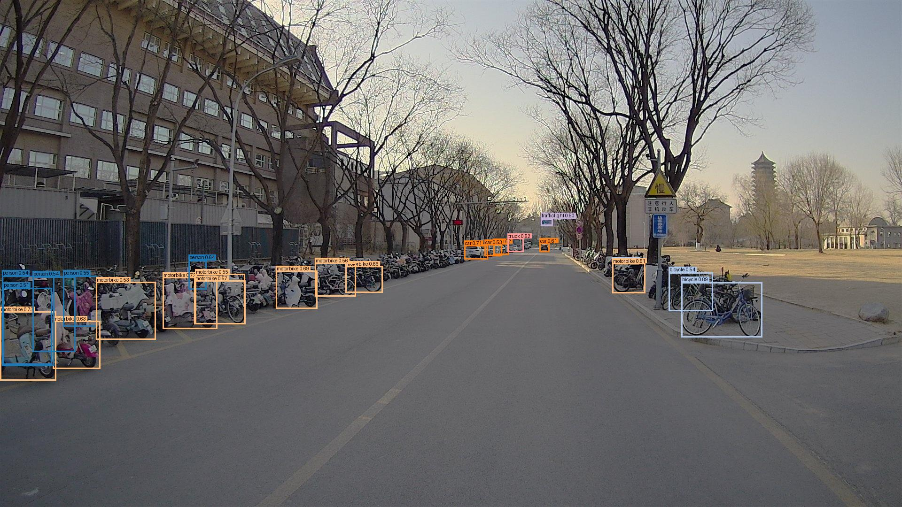

# Intelligent Mobile Robot Endterm Report
*ZhijiangTang @ HAIS, UCAS, 5/4/2025*

This is the code for the Intelligent Mobile Robot course endterm report. The detailed report is in [Report](<Endterm Report.pdf>).


- [Run it](#run-it)
- [Introduction](#introduction)
- [Help](#help)

### Run it

#### Environment
Building a Docker Image
```bash
docker pull osrf/ros:foxy-desktop
docker run --gpus all --name foxy -e DISPLAY=host.docker.internal:0.0 -it osrf/ros:foxy-desktop
```

Configure Python environment
```bash
pip install -r requirements.txt
```
Download relevant [data](data) and model [checkpoints](checkpoints) in Sec [Introduce](#introduce).
#### Detection
Real-time object detection
```bash
# New terminal: play data
ros2 bag play ./data/pku_campus.db3 
# New terminal: detection node
python3 run_ros2.py --model_name DEIM_S
# New terminal: visualization
ros2 run rviz2 rviz2
```
Detect image and save as MP4.

```bash
# New terminal: play data
ros2 bag play ./data/pku_campus.db3 
# New terminal: decompress the image and save it
python3 CompressedToImageNode.py
# New terminal: detection
python3 run_inference.py
# New terminal: generate mp4
python3 run_video.py
```
#### Results
Since the dataset is unlabeled, there is no quantitative result. The qualitative results can be seen in the [demo detection](figures/demo_detection.mp4) and [demo real time](figures/demo_realtime.mp4).


<div style="display: flex; justify-content: center; text-align: center;">
  <div >
    <p>DEIM</p>
    
  </div>
  <div >
    <p>RT-DETR</p>
    
  </div>
  <div >
    <p>YOLOv8</p>
    
  </div>
</div>


### Introduction
#### Dataset
Outdoor dataset (including camera, 80-line lidar, GNSS/IMU)
1. Baidu Cloud Disk: Link: https://pan.baidu.com/s/1EHePy3gB7rNF5pt4zW79Fw?pwd=jvsj Extraction code: jvsj
2. Quark Cloud Disk: Link: https://pan.quark.cn/s/e785a28cbbe2 Extraction code: 5nuC
#### Models
- DEIM: DETR with Improved Matching for Fast Convergence [[Paper]](https://arxiv.org/pdf/2412.04234)[[Code]](https://github.com/ShihuaHuang95/DEIM)
- RT-DETRv2: Improved Baseline with Bag-of-Freebies for Real-Time Detection Transformer [[Paper]](https://arxiv.org/pdf/2407.17140)[[Code]](https://github.com/lyuwenyu/RT-DETR)
- Ultralytics [[Paper]](https://docs.ultralytics.com/zh#where-to-start)[[Code]](https://github.com/ultralytics/ultralytics.git)


### Help
Some useful commands
```bash
ros2 topic echo /front/compressed --no-arr
```
